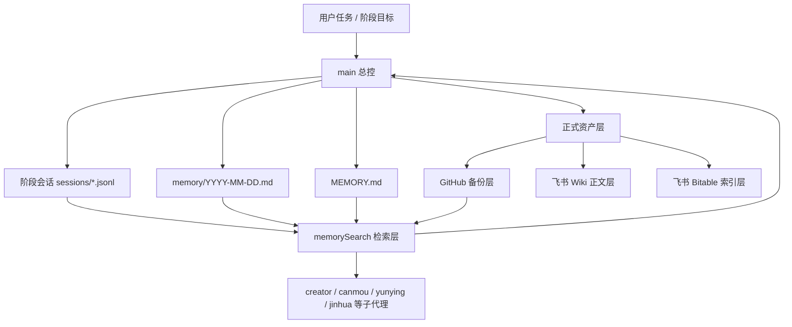
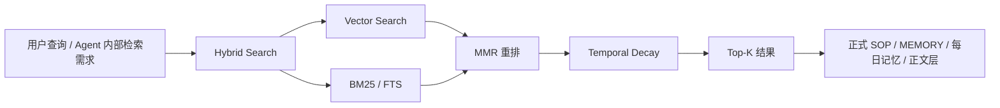
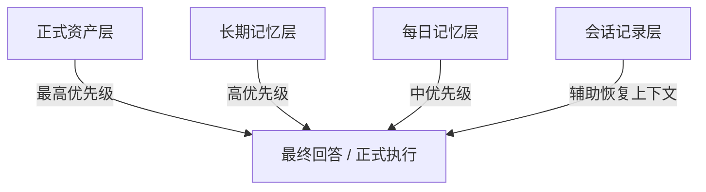
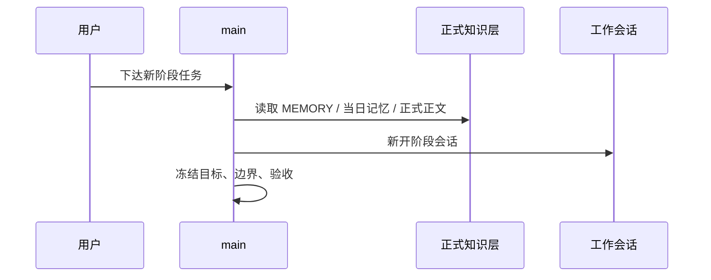
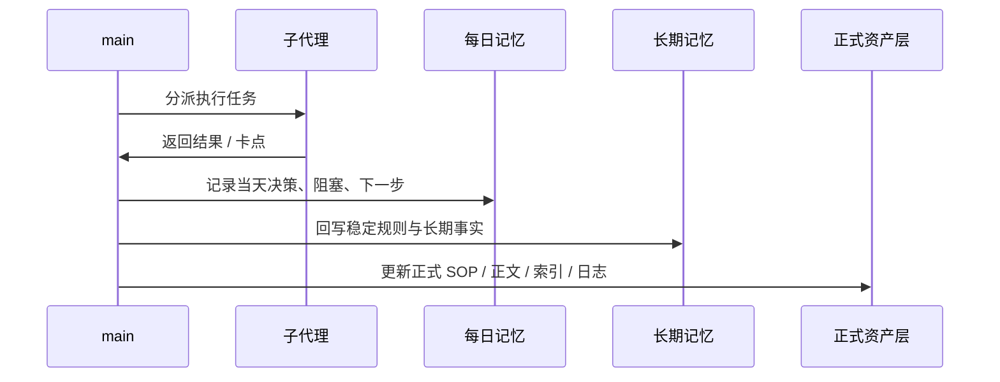
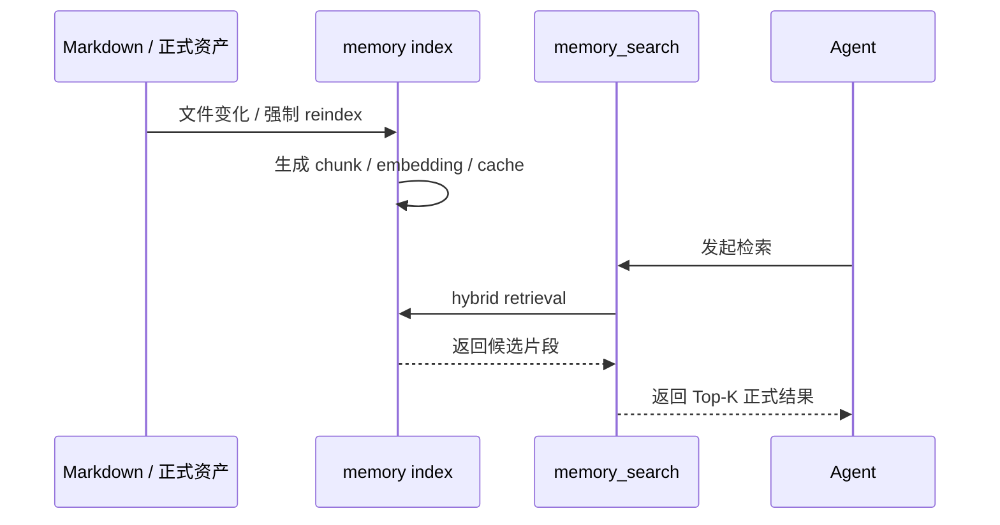

# OpenClaw 会话管理与记忆架构

## 背景与目标
OpenClaw 在 Daniel实验室 当前产品化体系中的一个关键变化，是已经不再把“长期项目记忆”寄托在超长聊天上下文里，而是把会话治理、文件记忆、语义检索和正式资产沉淀组合成一套可持续运行的记忆架构。这个变化的重要性，不低于角色分工、飞书协同或手册分层，因为它直接决定系统是否能够在多阶段、多角色、长周期的真实工作中保持稳定。

如果没有正式的记忆架构，OpenClaw 很容易退回到以下状态：
- 主会话越来越长，最终把上下文窗口拉满；
- 关键结论停留在某一次聊天里，后续无法稳定召回；
- 角色之间只能依赖临时转述，而不是依赖正式资产；
- 阶段结束后没有 durable memory，导致新阶段需要重复解释背景；
- 真正重要的规则没有被沉淀为 SOP、长期记忆或正式正文。

因此，本篇的目标不是解释“OpenClaw 也有 memory”，而是把 Daniel实验室 当前已经落地的会话治理与记忆体系，整理成正式的产品化正文，回答以下问题：
- 当前 OpenClaw 的记忆到底由哪些层组成；
- 这些层分别承载什么，不承载什么；
- `memorySearch` 如何与 Markdown 记忆、会话记录和正式手册协同；
- 当前已经完成了哪些正式能力，哪些仍然需要后续持续优化；
- 为什么这个体系能够支撑 OpenClaw 产品化手册、飞书正文层和 GitHub 备份层的长期运行。

## 设计原则

### 1. 先治理会话，再谈长期记忆
很多“记忆失效”的根因，不是检索能力不足，而是会话本身没有被治理。Daniel实验室 当前已经明确：如果继续把几十轮任务压在同一条主会话上，再强的模型也会逐渐失去清晰边界。因此，记忆架构的第一原则不是“多存一点”，而是“先防止主会话失控”。

### 2. 记忆必须分层，不允许单层承担所有角色
OpenClaw 当前已经明确采用分层记忆，而不是单一记忆仓库。原因很简单：即时上下文、当天决策、长期事实、正式资产属于不同生命周期和不同可信度，不能混成一层。如果把临时执行结果、稳定偏好和正式 SOP 写在同一层，后续检索与维护都会失真。

### 3. 检索层负责召回，不负责创造事实
`memory_search` 的职责，是帮助模型从已有正式材料与记忆文件中召回相关片段，而不是生成新的“事实来源”。Daniel实验室 当前已经明确：真正重要的结论，必须回写到 Markdown 记忆或正式资产层，不能把一次检索命中误当成正式沉淀完成。

### 4. 记忆架构必须能被审计、交接和维护
产品化环境中的记忆，不能依赖不可见的模型内部状态。它必须能够回答：
- 记忆写在哪里；
- 谁维护；
- 如何检索；
- 索引何时刷新；
- 如果检索失败该如何排查；
- 哪些内容属于正式知识，哪些只属于会话噪音。

### 5. 主代理与执行代理的记忆面不应完全相同
总控代理需要优先看到正式规则、长期边界和正式正文；执行代理则可能更需要最近阶段的会话上下文与局部执行历史。因此，Daniel实验室 当前已经开始将 `main` 与其他角色的检索面区分开来，避免主代理长期知识查询被会话流水淹没。

## 当前正式架构

### 四层记忆结构
当前 OpenClaw 已经形成以下四层记忆结构：

1. 会话记忆
- 载体：`~/.openclaw/agents/<agentId>/sessions/*.jsonl`
- 作用：承载当前阶段和近期执行上下文
- 边界：不作为长期事实唯一来源

2. 每日记忆
- 载体：`memory/YYYY-MM-DD.md`
- 作用：记录当天的决策、卡点、进展、下一步
- 边界：只追加，不覆盖历史

3. 长期记忆
- 载体：`MEMORY.md`
- 作用：记录稳定偏好、长期规则、固定边界、系统事实
- 边界：不承载临时流水

4. 资产记忆
- 载体：GitHub 正文、飞书 Wiki 正文层、飞书 Bitable 索引层
- 作用：承载正式 SOP、模板、样板、主干正文、阶段日志
- 边界：这是项目级真相源，不是随手记录区

### 当前架构图

### 当前主路径说明
当前 Daniel实验室 已经形成的主路径，不是“先聊天再看看记不记得”，而是：
1. 阶段任务进入会话；
2. 关键结果写入 `memory/YYYY-MM-DD.md`；
3. 长期稳定事实进入 `MEMORY.md`；
4. 正式规则和正文进入 GitHub / Wiki / Bitable；
5. `memorySearch` 对这些材料进行索引与召回；
6. 下一阶段再从正式层和记忆层恢复上下文，而不是依赖上一轮长聊天。

## 当前已落地的能力

### 1. 会话治理规则已正式化
截至 2026 年 3 月 25 日，OpenClaw 已正式建立会话管理与记忆分层 SOP，并形成以下默认规则：
- 一阶段一会话；
- `main` 只负责冻结目标、边界与验收，不长期承担大规模执行细节；
- 上下文占用超过一定阈值时必须考虑切阶段、切会话；
- 阶段结束前，必须把 durable memory 回写到每日记忆或长期记忆层。

### 2. Markdown 记忆层已建立
当前已落地：
- 主工作区全局 `MEMORY.md`
- 主工作区 `memory/YYYY-MM-DD.md`
- 各子代理自己的 `MEMORY.md`
- 各子代理自己的当日 `memory/YYYY-MM-DD.md`

这意味着 OpenClaw 当前已经不再只是“会话里有背景”，而是有明确的磁盘级长期记忆。

### 3. 语义检索层已跑通
当前 `memorySearch` 已不再停留在配置层，而是已经完成：
- provider 可用性验证；
- embeddings readiness 验证；
- 强制重建索引；
- 检索回归验证。

截至 2026 年 3 月 25 日，本地环境中的关键结果包括：
- 主代理 `main` 已形成完整 memory index；
- 主工作区的正式记忆与额外正式资产路径已进入索引；
- 子代理工作区也分别拥有各自独立的索引存储；
- `memory_search` 已能够命中会话治理、长期知识库、角色职责、飞书同步等核心主题。

### 4. 主代理检索面已开始收敛
为了避免总控代理长期知识查询被会话碎片淹没，当前 `main` 已收敛为优先查正式记忆层，而不是把 `sessions` 作为长期知识查询的首要来源。这是一个重要变化，因为它让总控代理更接近“手册检索器”，而不是“聊天流水检索器”。

## 当前 memorySearch 正式口径

### 当前配置方向
当前 OpenClaw 的正式记忆检索层已采用以下稳定口径：
- embeddings 走阿里云百炼兼容 OpenAI 的接口；
- 模型使用 `text-embedding-v4`；
- hybrid search 开启；
- MMR 去重重排开启；
- temporal decay 开启；
- chunking 已显式配置；
- embedding cache 开启；
- session memory 仍保留给执行角色使用；
- 主代理的长期知识查询已开始偏向正式 memory 层。

### 当前检索结构图

### 为什么要 hybrid + MMR + temporal decay
Daniel实验室 当前不是在做通用搜索引擎，而是在做长期项目知识召回。这个场景的特征非常明确：
- 有很多自然语言主题，例如“会话治理”“长期知识库”；
- 也有很多高信号术语，例如 `memorySearch`、`compaction`、`Bitable`；
- 还存在大量近似重复的阶段记录与会话片段；
- 新近的决策通常比数天前的噪音更值得优先看见。

因此：
- hybrid search 保证语义匹配和关键词匹配可以同时工作；
- MMR 用来降低近似重复结果占满前几名的概率；
- temporal decay 用来让近期阶段事实优先于过期噪音。

## 当前检索面与信任边界

### 当前主要索引来源
当前 OpenClaw 已索引的主要正式来源包括：
- `MEMORY.md`
- `memory/YYYY-MM-DD.md`
- `OPENCLAW_SESSION_AND_MEMORY_SOP.md`
- `PROGRESS.md`
- `docs/openclaw/` 下正式正文
- 飞书镜像文档
- 各 agent 的会话记录与角色记忆

### 信任边界说明
并不是所有可检索内容都等价可信。当前应区分：

#### 第一层：正式资产
- GitHub 正文
- 正式 SOP
- 正式模板与样板
- 已冻结的长期记忆

这一层应视为当前产品化体系的最高优先级知识。

#### 第二层：每日记忆
- 记录当天决策、阻塞、推进动作
- 价值高，但仍需结合正式资产验证

#### 第三层：会话记录
- 可以帮助恢复上下文
- 但不应替代正式事实层
- 对主代理尤其不能成为默认前排来源

### 当前信任边界图

## 角色分工与维护职责

### `main`
- 冻结阶段边界与验收口径；
- 判断当前问题应优先查正式资产还是执行上下文；
- 防止长期项目继续依赖单条主会话推进。

### `jinhua`
- 负责记忆结构、配置与复杂落地；
- 负责把检索能力从“配置存在”推进到“真实可用”；
- 负责当结构、索引、目录或正式承载面发生变化时做工程化收口。

### `yunying`
- 更适合维护状态层、周期性维护节奏、阶段推进记录；
- 确保记忆相关更新在索引层和正式层中可追踪。

### 其他角色
- `creator` 更关注内容层长期资产；
- `canmou` 更关注方向、研究和判断类知识；
- `shequ` 更关注反馈回流；
- `jiaoyi` 更关注交易主题的局部执行知识。

记忆架构并不是“全角色共用一个模糊知识池”，而是“全局正式层 + 角色局部层”的组合。

## 当前工作流程

### 新阶段开始流程

### 阶段执行与落记忆流程

### 索引刷新与召回流程

## 当前正式成果与阶段性结论

### 截至 2026 年 3 月 25 日已明确完成
- 会话管理与记忆分层 SOP 已建立；
- 全局长期记忆与每日记忆文件已建立；
- 各子代理长期记忆与角色记忆文件已建立；
- `memorySearch` 已完成 provider 与 embeddings 端点配置；
- 语义索引已完成重建；
- recall 优化与 ranking 优化已开始形成正式策略；
- 主代理检索已开始优先正式 memory 层。

### 这意味着什么
这意味着 OpenClaw 当前已经不再只是“能执行任务的多代理系统”，而是已经具备了以下产品化基础：
- 可检索的长期知识库；
- 可维护的会话治理机制；
- 可交接的正式知识边界；
- 可验证的索引与召回路径；
- 可继续扩写成完整手册的正式记忆架构。

## 风险、限制与边界

### 1. 检索结果仍不是自动真相
即使检索层已经跑通，也不能把检索结果本身等同于正式事实。当前正式口径仍然是：高优先级回答优先引用正式正文、长期记忆和正式 SOP。

### 2. 召回已经改善，但排序仍需持续调优
当前 recall 已经显著提升，但 ranking 并非一次性完工。后续仍需持续优化：
- 哪些文档应进入主代理默认检索面；
- 哪些材料应留给执行角色；
- 如何让正式资产更稳定地出现在前两位。

### 3. 记忆文件不是越多越好
如果每日记忆变成流水账、长期记忆混入临时事项、正式资产与记忆文件重复堆叠，系统同样会重新失控。当前必须继续坚持分层和写入边界。

### 4. 本篇不覆盖的内容
本篇不讨论：
- 站点前端实现；
- EdgeOne 部署；
- 内容发布与外部分发；
- 非当前稳定范围内的外部知识库扩展方案。

## 与其他文档的关系
- 与 `openclaw-product-overview.md`：总览给出产品化整体框架，本篇具体解释会话治理与记忆架构如何让这个框架长期可运行。
- 与 `environment-installation-and-configuration.md`：环境篇说明正式承载面与默认路径，本篇说明 `memorySearch`、Markdown 记忆与阶段会话如何协同。
- 与 `model-channel-and-feishu-collaboration.md`：模型与渠道篇说明协同闭环，本篇补充“长期知识如何被维护和召回”。
- 与 `multi-agent-architecture-and-responsibilities.md`：角色篇说明谁负责什么，本篇说明谁维护哪一层记忆。
- 与 `manual-maintenance-sop.md`：维护 SOP 负责长期维护节奏，本篇负责记忆体系本身的正式说明。

## 维护方式
本篇应在以下场景更新：
- 会话治理规则发生稳定变化；
- `memorySearch` provider、索引结构或检索策略发生稳定变化；
- 主代理与子代理的检索面发生正式调整；
- 新的正式记忆承载层进入产品化范围；
- 召回优化从试验口径升级为正式长期规则。

如果只是一次普通阶段写入、一条日记更新或一次局部授权事件，不应频繁改动本篇，而应优先更新当日记忆、正式日志或对应专题正文。
